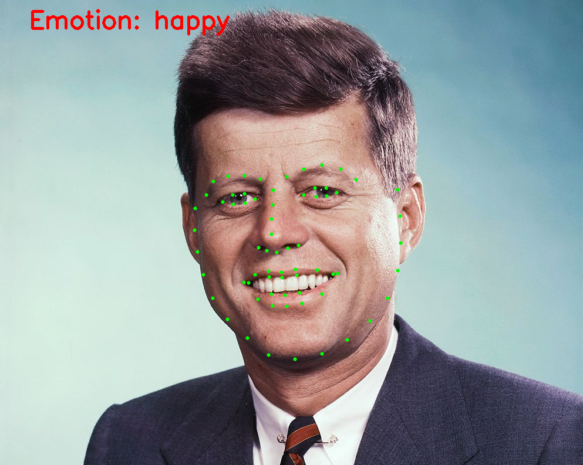

# Real-Time Face Landmark Detection and Emotion Recognition

This project demonstrates real-time face landmark detection and emotion recognition using **dlib** and **DeepFace**. It processes a video file or webcam feed and performs face detection, landmark annotation, and emotion prediction on every frame.

Below is a demonstration of the project in action:



*Image showcasing the annotated facial landmarks and predicted emotion in a video frame.*

## Features
- **Face Detection**: Detects faces using dlib's pre-trained frontal face detector.
- **Landmark Detection**: Identifies 68 facial landmarks for each detected face.
- **Emotion Recognition**: Predicts the dominant emotion for each face using DeepFace.
- **Real-Time Processing**: Works with live webcam input or video files, processing every 4th frame.

## Dependencies

To ensure the project runs smoothly, the following dependencies are required:

- **Python 3.8+**: The script is compatible with Python version 3.8 or higher.
- **OpenCV**: For video and image processing.
- **dlib**: For face detection and landmark prediction.
- **DeepFace**: For emotion recognition using deep learning.

Install these dependencies using pip:
```bash
pip install opencv-python dlib deepface
```
## Usage 
### Running the Script

#### Using Webcam
By default, the script uses your webcam as the video source. To run the project, simply execute:
```bash
python main.py
```
### Using Prerecorded Video
Alter the value of 'video_path' variable on line 10 of **main.py** to the path of the intended video. Then to run execute:
```bash
python main.py
```
